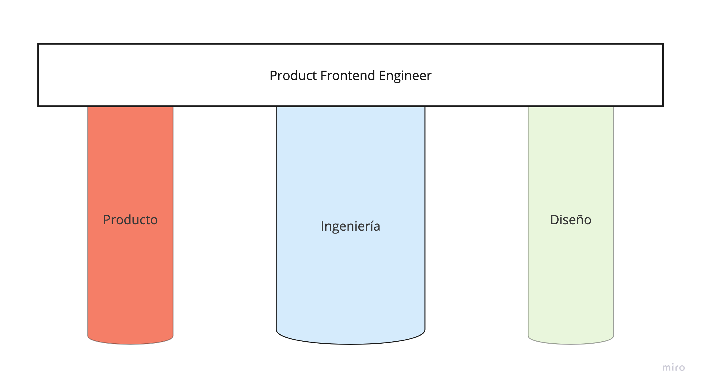

_¿Por qué?_ y _¿para qué?_ Son dos grandes preguntas que dan sentido y significado a lo que hacemos. No se trata solo de ejecutar, de lo que trata realmente ese juego es de resolver problemas reales de la humanidad, empoderándola para que siga creciendo y se siga desarrollando.

Como ingenieros debemos ayudar a dar respuesta a muchas de las incógnitas que se plantean en nuestro proyecto: ¿_qué vamos a hacer_? y ¿_cómo lo vamos a hacer_?

## No te olvides de quién te da de comer

La tecnología puede actuar en las empresas de dos formas: como principal activo que genera ingresos para la misma o como soporte que ayuda al negocio principal que genera el beneficio de la compañía. Ya sea de una forma u otra, la tecnología sirve para un propósito, para una función, y como ingenieros debemos conocerla.

En ocasiones tendrás la suerte de conocer a las personas que usan tu producto e incluso hablar con ellas a diario y discutir el futuro del producto juntos. En otras ocasiones, sobre todo en empresas con un producto comercializado, te será más difícil acceder a estar personas y por lo tanto lo único de lo que dispondrás es de encuestas de satisfacción, entrevistas o métricas. Sea cual sea el caso, no te olvides de lo que genera beneficios en la compañía. Ayudar a remar en esa dirección no sólo te dará más posibilidades de generar productos de valor, sino también te ayudará a ganarte una reputación que te puede ayudar más tarde a crecer.

No olvides nunca dónde está el dinero.

## Mide lo que importa

John Doerr nos enseña en _Mide lo que importa_ a cómo establecer OKR que nos ayuden a impulsar el crecimiento y el éxito de la empresa. Es normal cuando empezamos a utilizar herramientas que miden cómo las personas utilizan nuestra aplicación, tendamos a medir más de la cuenta, sin un propósito y lo que es peor, sin ningún tipo de control.

Cada métrica tiene que tener un objetivo, un fin, un ciclo de vida en general. Es decir, tiene que ser creada con un propósito, analizada durante un periodo de tiempo y desechada cuando ya no sea de utilidad.

Hablar con los equipos de producto y diseño ayuda a identificar estas necesidades de nuevas métricas. Reúnete con ellos para ver en qué están pensando y analizad los resultados en conjunto para ver qué cambios en la interfaz o en el flujo del usuario pueden mejorar la experiencia general de la aplicación.

Luego hay métricas _evergreen_, que no caducan y que siempre debemos estar midiéndolas, como el porcentaje de peticiones fallidas al backend, datos demográficos de nuestros usuarios, páginas vistas, etc. La cantidad de estas métricas dependerá, como siempre, del contexto. No necesitarás tanta información si trabajas en una herramienta interna para una empresa que si estás desarrollando una aplicación para el público general.